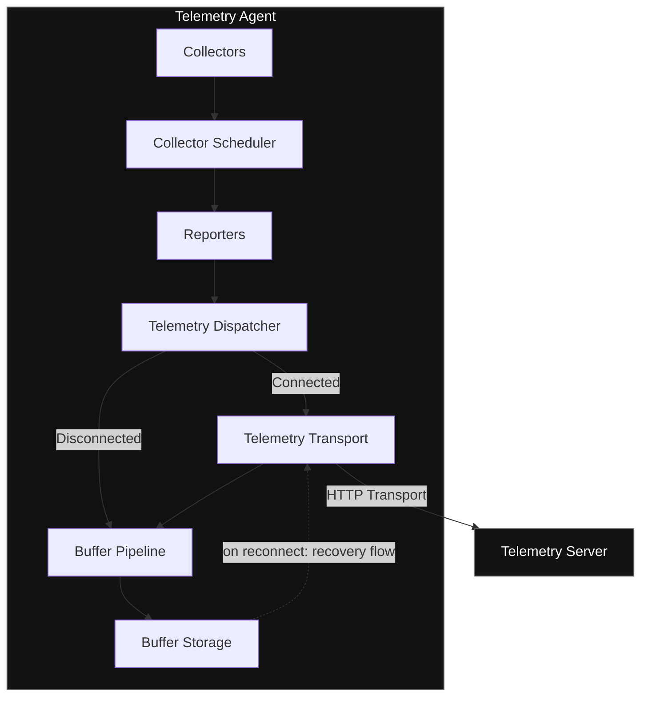

# Telemetry

**A lightweight, secure, and extensible telemetry platform built with Java and Spring Boot.**

---

## Overview

Telemetry is a self-hosted observability platform made up of two independent applications:

| Component | Description |
|---|---|
| **Telemetry Agent** | A lightweight Java agent responsible for system metric collection, telemetry processing, buffering, and secure delivery. |
| **Telemetry Server** | A Spring Boot backend responsible for agent authentication, telemetry ingestion, storage, and exposing APIs for visualization. |

The platform is built around **Clean Architecture**, **SOLID principles**, and modular design practices, with the goal of staying extensible as new collectors, transports, and storage backends are added.

The agent is designed to keep operating through temporary network failures, using telemetry buffering and an automatic recovery flow once connectivity returns.

---

## Table of Contents

- [Architecture](#architecture)
- [Features](#features)
    - [Telemetry Agent](#telemetry-agent)
    - [Telemetry Server](#telemetry-server)
- [Tech Stack](#tech-stack)
- [Design Principles](#design-principles)
- [Documentation](#documentation)
- [Project Status & Roadmap](#project-status--roadmap)
- [License](#license)

---

## Architecture

Telemetry follows an agent → server pipeline. Metrics move from collectors, through a scheduler and reporters, into a dispatcher that manages the connection lifecycle, buffers on disconnect, and flushes to the server once reconnected.

**Flow summary:**
1. **Collectors** (CPU, Memory, Disk) gather raw metrics on a schedule.
2. The **Collector Scheduler** triggers each collector at its configured interval.
3. **Reporters** package collected metrics into telemetry payloads.
4. The **Telemetry Dispatcher** routes payloads based on connection state:
    - **Connected** → sent directly over the **Telemetry Transport** (HTTP).
    - **Disconnected** → routed into the **Buffer Pipeline** and held in **Buffer Storage**.
5. On reconnect, the **Telemetry Recovery Flow** drains buffered batches back through the transport, oldest-first, with overflow handling if the buffer fills.
6. The **Telemetry Server** ingests, authenticates, and stores incoming telemetry via **HTTP Transport**.

---

## Features

### Telemetry Agent

**Configuration & Identity**
- Configuration loading pipeline with multiple sources (arguments, properties, defaults)
- Identity persistence
- Agent registration
- Secure authentication

**Collector System**
- Independent, extensible collector architecture
- Collector registration
- Scheduled metric collection
- Platform-specific metric collection

  Supported collectors: **CPU**, **Memory**, **Disk**

**Telemetry Pipeline**
- Reporter-based telemetry processing
- Telemetry Dispatcher
- Pluggable transport layer
- JSON serialization
- HTTP telemetry transport

**Reliability Features**
- Heartbeat service
- Connection state management
- Observer-based state notification
- Telemetry buffering with overflow handling (oldest-batch eviction)
- Automatic telemetry recovery after reconnect

### Telemetry Server

**Authentication**
- JWT authentication
- Personal Access Token (PAT) authentication
- Agent token authentication
- Multiple Spring Security filter chains

**Telemetry Processing**
- Telemetry ingestion API
- Agent management APIs
- Dashboard APIs
- Latest-metrics cache

---

## Tech Stack

**Backend**
- Java 21 · Spring Boot 3.x · Spring Security · Spring Modulith · Spring Data JPA · Hibernate

**Agent**
- Java 21 · Java HTTP Client · `ScheduledExecutorService`
- Custom collector framework
- Observer, Strategy, and Command patterns

**Database**
- MySQL

**Build Tool**
- Maven

---

## Design Principles

Telemetry is built around:
- SOLID principles
- Clean Architecture
- Dependency injection
- Interface-driven design
- Separation of responsibilities
- Event-driven components

**Design patterns in use:** Observer · Strategy · Command · Factory · Registry

---

## Documentation

- 📘 [Architecture](ARCHITECTURE.md)
- 📙 [REST API](API.md)

---

## Project Status & Roadmap

**Current version: `v1.0.0`**

**Implemented**
- ✅ Agent Registration
- ✅ Authentication Pipeline
- ✅ Identity Persistence
- ✅ Collector Framework
- ✅ Scheduled Metric Collection
- ✅ Heartbeat System
- ✅ Telemetry Dispatcher
- ✅ Telemetry Transport
- ✅ Buffer Pipeline
- ✅ Telemetry Recovery Flow
- ✅ Server Telemetry Ingestion

### v1.1 — Dashboard & Visualization
- Telemetry history
- Charts
- Metric explorer
- Agent status dashboard

### v1.2 — Collector Management
- Remote collector control
- Enable/disable collectors
- Collector health monitoring
- Dynamic configuration updates

### v2.0 — Distributed Telemetry Infrastructure
- Kafka integration
- Redis caching
- WebSocket streaming
- Alert engine
- Rule-based monitoring

---

## License

Distributed under the [MIT License](LICENSE).